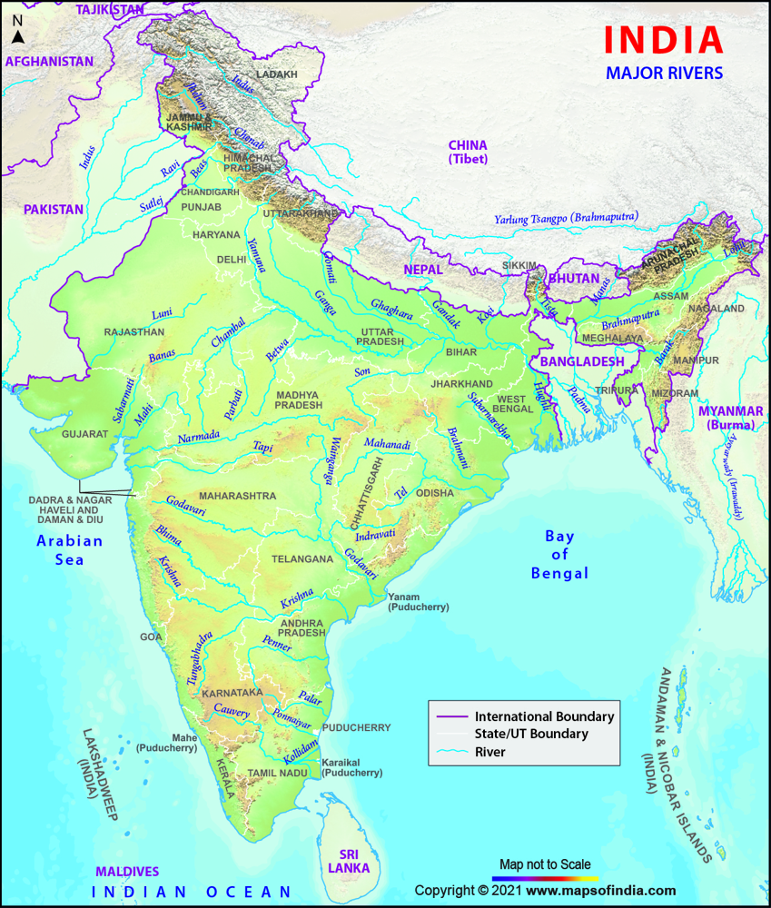

This blog post explore why rivers are polluted, explained in a simple and easy-to-understand way. It is written for people with little or no prior knowledge about rivers, helping them understand the current condition of our rivers and encouraging thoughtful discussion and learning.

# Why Rivers Are Polluted

This post is to explore **why our rivers are polluted**, explained simply for newcomers. It welcomes readers of all backgrounds and uses clear language to explain the current state of our waterways. You’ll learn basic facts about major Indian rivers, the main sources of pollution they face, and why cleanup is challenging. Our goal is to spark curiosity and thoughtful discussion about these issues, so that everyone — even without a science background — can understand the problems and help find solutions.

### Map of Major Indian Rivers:

*Map of India’s major river systems (Himalayan rivers in the north, Peninsular rivers in the south).*

India’s river systems fall into two broad groups: **Himalayan rivers** (fed by snowmelt, mostly flowing east or west from the mountains) and **Peninsular rivers** (monsoon-fed, flowing east or west across the plateau). Below are brief descriptions of the largest rivers, noting their courses and current conditions:

- **Ganga (Ganges):** India’s longest and most famous river, rising in the Himalayas and flowing 2,500+ km east to the Bay of Bengal. It provides water to about 40% of India’s people (roughly 500 million). Despite its cultural importance, the Ganga is heavily polluted: _about three-quarters of the sewage from its basin is released untreated_ into the river. Industrial effluents and household waste have made its water unsafe in many stretches.

- **Yamuna:** The largest tributary of the Ganga, originating in Uttarakhand and meeting the Ganga at Prayagraj. It flows through Delhi and on to Uttar Pradesh. About 57 million people rely on the Yamuna, and it supplies roughly 70% of Delhi’s drinking water. Today the Yamuna is _critically polluted_ in many parts – especially below Delhi. Roughly half of Delhi’s sewage ends up in the Yamuna, turning it into a foul, oxygen-starved drain in its lower reaches.

- **Sindhu (Indus):** Originating near Tibet, the Indus flows through northern India (Ladakh, Jammu) into Pakistan and down to the Arabian Sea. It is one of the world’s major rivers – providing irrigation to about 65% of Pakistan’s farmland and serving 180 million people. In India, its tributaries include the Sutlej, Beas, Ravi, and Chenab. The Indus basin is stressed by **agricultural runoff and urban waste**: fertilizers and pesticides from fields, plus untreated sewage and industrial effluents, enter its waters.

- **Brahmaputra:** Rising on the Tibetan Plateau (called the Yarlung Tsangpo there), the Brahmaputra enters India through Arunachal Pradesh, flows through Assam, and joins the Ganga in Bangladesh. It carries the greatest volume of water of any Indian river. While its upper reaches are relatively clean, the Brahmaputra is becoming polluted in Assam. Cities along the river lack proper sewage treatment, so _large amounts of urban wastewater and trash flow directly into it_, especially around Guwahati, degrading water quality.

- **Narmada:** Originating in central India (Madhya Pradesh) and flowing west to the Arabian Sea, the Narmada is about 1,312 km long. It crosses Madhya Pradesh, Maharashtra, and Gujarat. Historically a perennial river, it is now often a trickle. The **Sardar Sarovar dam** and other projects hold back most freshwater, and industries along its banks dump untreated waste. Locals report that boats now “get stuck on the banks” and that _untreated sewage and industrial effluent are making the Narmada salty and biologically “dead”_.

- **Godavari:** Known as the “Southern Ganges,” the Godavari is India’s second-longest river (~1,465 km). It rises in Maharashtra and flows east across Telangana and Andhra Pradesh into the Bay of Bengal. Its basin covers about 10% of India’s area. The Godavari supports millions (for drinking water and agriculture), but faces pollution too – algal blooms in its reservoirs and high-alkalinity runoff (from power plants and mines) have been reported.

- **Krishna:** Approximately 1,300 km long, the Krishna flows from western Maharashtra through Karnataka, Telangana, and Andhra Pradesh to the Bay of Bengal. It’s a vital water source for agriculture in these states. Unfortunately, it is now heavily polluted. A 2015 study found toxic salts and heavy metals suspended in the river. In particular, urban centers like Hyderabad and Vijayawada discharge _massive amounts of untreated sewage and industrial waste_: the National Green Tribunal noted Hyderabad alone dumps about **598 million liters** of untreated sewage into the Krishna every day.

- **Kaveri (Cauvery):** This ~800 km river starts in the Western Ghats of Karnataka and flows eastward into Tamil Nadu. It was once known for clear water, but now suffers pollution from sewage and factories. Its color has even changed to a yellow or brown tint in places where **untreated industrial effluent and raw sewage** enter it. For example, Bangalore discharges _200–300 million liters_ of untreated sewage into the Kaveri every day.

- **Mahanadi:** About 858 km long, the Mahanadi flows through Chhattisgarh and Odisha to the Bay of Bengal. It’s impounded by the large Hirakud Dam. Industrial cities (like Rourkela steel plant) and extensive coal and iron mining in its basin are major pollution sources. (Studies have found heavy metals and acid mine drainage in the Mahanadi.) In short, **no big Indian river is untouched** – each of the above suffers pollution from a mix of sewage, industry and farming.

_(Other important rivers, like the Tapti, Mahi or Sabarmati, also face similar issues. But our focus here is on the largest systems above.)_

## Lessons from Successful River Cleanups

It can be done! Around the world, rivers once declared “dead” have been revived by sustained action. These examples give hope and ideas:

- **Thames (London, UK):** In the 1950s the Thames was essentially a dead river; sewage and chemicals made it unliveable for fish. After decades of strict wastewater treatment and banning toxic discharges, the Thames has come back to life. Today it hosts over **120 species of fish** (even salmon and sea trout have returned) and healthy wildlife. As conservationists noted, “The Thames may have been declared ‘biologically dead’ in the 1950s, but the estuary we see today demonstrates just how quickly things can change when decisive action is taken”.

- **Rhine (Germany/Europe):** Once called “the sewer of Europe,” the Rhine was heavily polluted by chemical industries in the 1960s–70s. International cooperation (among Germany, France, Switzerland, etc.) and strict EU regulations have turned it around. Now the Rhine is one of Europe’s **cleanest** large rivers: fish and even river-dolphins (belugas) have been sighted returning. The transformation of the Rhine shows how effective laws and cross-border efforts can restore a major waterway.

- **Chicago River (Illinois, USA):** In the late 1800s Chicago famously reversed the river’s flow to protect drinking water in Lake Michigan. In the 20th century it was still a dumping ground, but strong U.S. laws (Clean Water Act) and local cleanup initiatives have greatly improved it. A recent study found _at least 24 species of fish_ now reproducing in the Chicago River, a sure sign the water has become much cleaner. (Indeed, officials have noted efforts like sewage treatment and riverfront restoration are working.)

## Main Causes of River Pollution in India

In India, rivers become polluted from many sources. Here are the key categories, in simple terms:

- **Industrial waste:** Factories (tanneries, paper mills, chemical plants, etc.) often discharge toxic effluents into rivers without adequate treatment. These may contain heavy metals, acids, or organic pollutants. For example, chemical industries along the Ganga and Yamuna rivers release untreated waste that raises pollution levels sharply.

- **Domestic sewage:** Rapid urban growth has outpaced sewage treatment. Millions of homes in Indian cities do not connect to treatment plants, so raw sewage flows into river drains. In the Ganga basin, _about 75% of sewage is untreated_. The Yamuna through Delhi receives the equivalent of hundreds of millions of liters of raw sewage every day.

- **Plastic and solid garbage:** Cities and villages dump **plastic bags, bottles, packaging, and other trash** into rivers. This causes clogs, harms wildlife, and releases microplastics (tiny plastic pieces) into the water. In fact, plastics make up a large part of the solid waste polluting Indian rivers. Priests and pilgrims also contribute polythene: traditional “offerings” like cloth, flowers and painted idols (often made of plaster) are left in rivers, which adds foam, dyes and plastics.

- **Agricultural runoff:** Fields along rivers use fertilizers and pesticides. Rain washes these chemicals into waterways, causing nutrient pollution (algae blooms) and poisoning fish. For example, fertilizers add excess nitrates and phosphates to rivers, a problem noted even for the Indus river downstream.

- **Religious and cultural offerings:** As noted, ritual bathing, idol immersion and offerings in rivers introduce non-biodegradable waste (like synthetic dyes and polythene) and sometimes toxic substances into the water. A recent report found that painted idols left in the Yamuna raised its heavy metal content (lead, chromium, etc.) far above safe limits.

- **Sand mining and construction debris:** Illegal sand extraction from riverbeds destroys habitats and increases sediment in water. Construction projects near rivers often dump debris (cement, rubble) into them. These activities change the river’s flow and harm its health, even if the pollution is mostly silt and suspended solids.

Overall, **urban and human waste** (sewage, garbage) plus **industrial effluent and farm runoff** are the biggest culprits. For example, untreated sewage and solid waste make up “a major part” of what’s dumped into many rivers. In summary, rivers suffer when we fail to treat our waste before it reaches the water.

## Hope and the Path Forward

Yes, Indian rivers face **serious challenges**, but the examples above show things can change. The Thames and Rhine rebounded within a few decades once strict controls were in place. Similarly, local and national efforts in India are beginning to pay off. The government’s **Namami Gange** program (launched 2014) has built hundreds of new sewage treatment plants along the Ganges and its tributaries. Early reports show improving water quality: officials note that stretches of the Ganga are no longer in the most polluted categories, and even **dolphins have reappeared** in its cleaner waters. In cities, citizen groups and technology-driven projects are removing trash by the ton and educating communities.

The key message is hopeful: **action makes a difference**. Cleaner rivers in other countries prove that recovery can be rapid when people care and laws are enforced. India’s own cleanup missions, bans on plastic, and growing public awareness mean we _can_ turn the tide. By learning about our rivers and sharing what we know, every one of us can help. Together, we can look forward to seeing India’s rivers regain health and vitality.