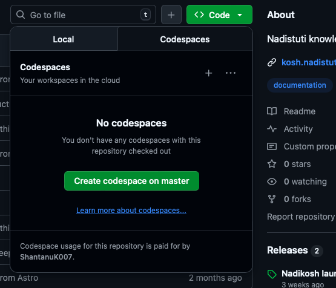

# 📝 Easy Guide: How to Edit Nadi Stuti Kosh Documentation

Welcome! This guide will help you contribute to our documentation website, even if you've never coded before. You don't need to install any software on your computer — everything works directly in your web browser! 🎉

---

## 🤔 Which Editing Method Should You Use?

Before we start, let's figure out which workflow is best for you:

### **Option 1: Quick Edits (Jump Directly to Codespace)**

**Choose this if:**

- ✅ You're making just a few small changes (fixing typos, writing a single article, updating a sentence or two)
- ✅ You want to see how your documentation looks on the actual website
- ✅ You're not worried about using your 60 free hours

**👉 If this sounds like you, skip ahead to [Part 2: Using GitHub Codespaces](#part-2-using-github-codespaces)**

---

### **Option 2: Extensive Writing (Web Editor + Codespace)**

**Choose this if:**

- ✅ You're writing lots of new documentation pages
- ✅ You want to save your free 60 Codespace hours
- ✅ You're comfortable writing in Markdown and just need occasional previews

**👉 If this sounds like you, start with [Part 1: Using the Web Editor](#part-1-using-the-github-web-editor)**

---

## 💡 Understanding Your Free 60 Hours

GitHub gives everyone **60 free hours per month** to use Codespaces (the cloud computer). Here's what that means:

- ⏱️ **What counts as "usage"?** Any time your Codespace is open in your browser, even if you're not typing
- 💰 **Why does it matter?** After 60 hours, you'd need to pay or wait until next month
- 🎯 **Pro tip:** Use the Web Editor for writing, and Codespace only when you want to see the live website preview

---

# Part 1: Using the GitHub Web Editor

The Web Editor is perfect for writing documentation without using any Codespace hours. Think of it as a simple notepad in your browser where you can write and preview your Markdown files.

## Step 1: Open the Web Editor

1. **Click this special link:** [https://github.dev/nadi-stuti/kosh](https://github.dev/nadi-stuti/kosh)

*(This opens GitHub's web-based editor directly in your browser — no downloads needed!)*
2. You'll see a screen that looks like a code editor. Don't worry, it's simpler than it looks! 😊

---

## Step 2: Create a New Branch

A "branch" is like creating your own workspace where you can make changes without affecting the main website. Here's how:

1. **Look at the bottom-left corner** of your screen. You'll see a small icon that looks like a branch with the word "**master**" next to it.
2. **Click on "master"** (or the branch icon).
3. A menu will pop up at the top. **Click "Create new branch..."**
4. **Type a name** for your branch. Make it simple and descriptive, like:
   - `add-ganga-page`
   - `fix-yamuna-typos`
   - `update-about-section`
5. **Press Enter** on your keyboard.

🎉 Great! You've created your own workspace!

---

## Step 3: Navigate to the Documentation Folder

Now let's find where the documentation files live:

1. **Look at the left side** of your screen. You'll see a file explorer (like folders on your computer).
2. **Click to open these folders in order:**
   - First, click on the **📁 src** folder
   - Then, click on the **📁 content** folder (inside src)
   - Finally, click on the **📁 docs** folder (inside content)
3. You'll now see all the documentation files! These are the pages of the website.

---

## Step 4: Edit or Create Documentation Files

### To Edit an Existing File:

1. **Click on any `.md` or `.mdx` file** you want to edit (these are Markdown files).
2. The file will open in the editor on the right side.
3. **Start typing** your changes!

### To Create a New File:

1. **Right-click** inside the `docs` folder (in the left sidebar).
2. **Click "New File"**.
3. **Type your filename** and make sure it ends with `.md` or `.mdx`:
   - Example: `ganga-river.md` or `cleaning-methods.mdx`
4. **Press Enter**, and start writing in your new file!

---

## Step 5: Learn Basic Markdown Formatting

Markdown is a simple way to format text. Here are the basics you need:

```markdown
# This is a Big Heading (use one # for main titles)

## This is a Medium Heading (use two ## for sections)

### This is a Small Heading (use three ### for subsections)

This is regular paragraph text. Just type normally!

**This text is bold** (wrap text in double asterisks)

*This text is italic* (wrap text in single asterisks)

- This is a bullet point
- Another bullet point
- One more bullet point

1. This is a numbered list
2. Second item
3. Third item

[This is a link](https://nadistuti.in)


```

Learn more over here [Markdown Guide](https://www.markdownguide.org)

---

## Step 6: Preview Your Edits

Want to see how your Markdown will look? Here's how:

### **Windows Users:**

- Open your file
- Press **`Ctrl + Shift + V`** on your keyboard
- A preview panel will appear showing your formatted text!

### **Mac Users:**

- Open your file
- Press **`Cmd + Shift + V`** on your keyboard
- A preview panel will appear showing your formatted text!

### **To See Side-by-Side:**

- Press **`Ctrl + K`** then **`V`** (Windows)
- Press **`Cmd + K`** then **`V`** (Mac)
- Now you'll see your code on the left and preview on the right! ✨

---

## Step 7: Save Your Changes

### **Commit Your Changes:**

Think of "committing" as saving a checkpoint of your work.

1. **Look at the left sidebar**. Click the **icon that looks like a branch with circles** (Source Control icon — it might have a blue badge with a number).
2. You'll see a list of files you changed.
3. **Type a short message** describing what you did in the text box at the top:
   - Good examples:
     - "Added new page about Ganga"
     - "Fixed typos in Yamuna section"
     - "Updated cleaning methods"
4. **Click the blue "Commit \& Push" button** (or "Commit" then "Push").

🎉 Your changes are now saved to your branch!

---

## Step 8: Create a Pull Request

A "Pull Request" is how you ask others to review your changes before they go live on the website.

1. After pushing your changes, **a notification will appear** at the bottom-right with a button that says **"Create Pull Request"**. Click it!

*(If you don't see it, go to [github.com/nadi-stuti/kosh/pulls](https://github.com/nadi-stuti/kosh/pulls) and click "New Pull Request")*
2. **Add a title** describing your changes.
3. **Add a description** if you want to explain what you did.
4. **Click "Create Pull Request"**.
5. Done! Someone will review your changes and merge them into the main website. 🎊

---

## ✨ When Should You Move to Codespace?

If you're working in the Web Editor and want to:

- **See the actual website** (not just Markdown preview)
- **Test navigation between pages**
- **See how everything looks together**

...then it's time to move to Codespaces! Continue reading below.

---

# Part 2: Using GitHub Codespaces

Codespaces is like having a complete computer in your browser where you can run the actual website and see exactly how it will look live.

## 🎯 What You'll Get in Codespaces

When you use Codespaces for this project, we've already set up:

- ✅ **Rich Markdown Editor** — Makes writing even easier with helpful tools
- ✅ **Instant Markdown Preview** — See your formatted text as you type
- ✅ **Automatic Formatting** — Your code stays neat and organized
- ✅ **Live Website Preview** — Run the actual website to see everything working
- ✅ **MDX Support** — Work with special Markdown files that have extra features
- ✅ **Astro \& Starlight Tools** — Everything you need for this documentation site

---

## Step 1: Create a Codespace

### **Starting Fresh (Not from Web Editor):**

1. **Go to the repository:** [github.com/nadi-stuti/kosh](https://github.com/nadi-stuti/kosh)
2. **Click the green `<> Code` button** at the top-right of the page.
3. **Click the "Codespaces" tab** in the popup.
4. **Click the green "Create codespace on main" button**.
5. **Wait 1-2 minutes** while GitHub prepares your workspace. ⏳



*(You'll see a loading screen — this is normal! GitHub is installing all the tools you need.)*

### **Transferring from Web Editor:**

If you already made changes in the Web Editor:

1. **Save and push your changes** in the Web Editor first (see Part 1, Step 7).
2. Follow the steps above to create a Codespace.
3. **Switch to your branch** in Codespaces:
   - Click the **branch name** in the bottom-left corner
   - Select **your branch name** from the list
   - Your changes will appear!

---

## Step 2: Create a New Branch (if starting fresh)

If you created a Codespace directly without using the Web Editor first:

1. **Look at the bottom-left corner**. You'll see "**main**" with a branch icon.
2. **Click on it**.
3. **Click "Create new branch..."**
4. **Type a descriptive name** like:
   - `add-narmada-page`
   - `update-cleanup-guide`
5. **Press Enter**.

🎉 Now you're working in your own safe space!

---

## Step 3: Navigate to Documentation Files

Just like in the Web Editor:

1. **Open the left sidebar** (file explorer).
2. **Navigate to:**

```
src → content → docs
```

3. Now you can **create or edit** any documentation file!

---

## Step 4: Using the Rich Markdown Editor

Our Codespace includes a special tool that makes writing Markdown even easier!

### **Open the Markdown Editor:**

1. **Right-click on any `.md` or `.mdx` file**.
2. **Select "Open With..."**
3. **Choose "Markdown Editor"** from the list.

### **What You Get:**

- 📝 **Live preview** as you type (no keyboard shortcuts needed!)
- 🔘 **Formatting buttons** at the top (bold, italic, lists, etc.)
- 📋 **Table of contents** generated automatically
- ✨ **Easier to use** than typing Markdown manually

### **OR Use Regular Editor + Preview:**

If you prefer typing Markdown yourself:

- **Windows:** Press **`Ctrl + Shift + V`** to see preview
- **Mac:** Press **`Cmd + Shift + V`** to see preview

---

## Step 5: Running the Live Website

This is where Codespaces shines! You can see the actual website running.

#### Option A: Using keyboard shortcuts (fastest way)

You have two quick keyboard shortcuts to start the dev server without using the menu:

- **F5** — Starts the development server
- **Ctrl + Shift + B** — Also starts the development server (alternative shortcut)

Simply press one of these keys when you are ready to run the site. A terminal will appear and the server will start automatically. This is the quickest way if you remember the shortcut.

### **Option B: Using the Task Menu**

1. **Click on the top menu:** `Terminal → Run Task...`
2. **Select:** `View Live Preview (npm run dev)`
3. **Wait a few seconds**. You'll see a notification at the bottom-right.
4. **Click "Open in Browser"** when the notification appears.
5. 🌐 **Your live website will open!** You can now browse all pages and see your changes in real-time.

### **Option C: Using the Terminal (Advanced)**

1. **Open a terminal:** `Terminal → New Terminal` from the top menu
2. **Type this command** and press Enter:

```bash
npm run dev
```

3. **Wait for it to finish** loading (you'll see some text and a web address).
4. **Click the URL** or notification to open the website.

---

## Step 6: Making Edits and Seeing Updates

Once the website is running:

1. **Edit any file** in the `src/content/docs` folder.
2. **Save the file** (`Ctrl + S` on Windows, `Cmd + S` on Mac).
3. **Switch to your browser** where the website is open.
4. **Refresh the page** (or it might auto-refresh!) — your changes will appear! ✨

---

## Step 7: Important! Save Your Free 60 Hours

Codespaces counts as "running" even when you're not typing. Here's how to save your free hours:

### **Reduce Idle Timeout:**

1. **Open this link:** [github.com/settings/codespaces](https://github.com/settings/codespaces)
2. **Find "Default idle timeout"** on the page.
3. **Select "5 minutes"** or **"10 minutes"** from the dropdown.
4. **Click Save**.

**What this does:** If you stop typing for 5-10 minutes, your Codespace will automatically "go to sleep" and stop using your free hours. You can wake it up anytime by clicking on it again!

💡 **Pro Tip:** We recommend **5 minutes** for maximum hour-saving!

---

## Step 8: Save Your Work Often!

Don't lose your changes! Commit and push regularly:

1. **Click the Source Control icon** on the left sidebar (looks like a branch with circles — might have a blue number badge).
2. **Review your changed files** in the list.
3. **Type a commit message** describing your changes:
   - "Added Saraswati river page"
   - "Updated introduction section"
   - "Fixed broken image links"
4. **Click "Commit"** button.
5. **Click "Sync Changes"** or **"Push"** button to save to GitHub.

🎯 **Do this every 15-30 minutes** or whenever you finish a section!

---

## Step 9: Stop Your Codespace When Done

When you're finished working:

1. **Close the browser tab** with your Codespace.
2. **OR** Click the **menu icon** (three horizontal lines) in the top-left → **"Stop Current Codespace"**

This stops using your free hours. Don't worry — your work is saved! You can come back anytime.

---

## Step 10: Create a Pull Request

When you're happy with all your changes:

1. **Make sure everything is committed and pushed** (Step 8).
2. **Go to:** [github.com/nadi-stuti/kosh](https://github.com/nadi-stuti/kosh)
3. You'll see a **yellow banner** saying "Your branch had recent changes" with a **"Compare \& Pull Request" button**.
4. **Click "Compare \& Pull Request"**.
5. **Add a title and description** explaining your changes.
6. **Click "Create Pull Request"**.
7. Done! Your changes will be reviewed and merged. 🎊

---

## 🆘 Helpful Shortcuts to Remember


| Action               | Windows             | Mac                |
| :--------------------- | :-------------------- | :------------------- |
| Save file            | `Ctrl + S`          | `Cmd + S`          |
| Markdown preview     | `Ctrl + Shift + V`  | `Cmd + Shift + V`  |
| Side-by-side preview | `Ctrl + K` then `V` | `Cmd + K` then `V` |
| Open terminal        | `Ctrl + `` `        | `Cmd + `` `        |
| Open command palette | `Ctrl + Shift + P`  | `Cmd + Shift + P`  |

---

## ❓ Frequently Asked Questions

### **Q: Which method should I really use?**

**A:** If you're just fixing a few typos or making small changes, use Codespaces directly. If you're writing several new pages or long articles, use the Web Editor for writing and Codespaces only when you want to see the full website.

### **Q: What if I run out of my 60 free hours?**

**A:** You'll need to wait until next month, or you can use the Web Editor which doesn't count toward your hours!

### **Q: How do I know how many hours I have left?**

**A:** Go to [github.com/settings/billing](https://github.com/settings/billing) and look for "Codespaces" usage.

### **Q: Can I use my phone or tablet?**

**A:** Yes! Both Web Editor and Codespaces work in mobile browsers, though it's easier on a computer or tablet with a keyboard.

### **Q: What if I make a mistake?**

**A:** Don't worry! That's what branches are for. Your changes won't affect the main website until someone reviews and approves them. And you can always undo changes with `Ctrl + Z` (or `Cmd + Z` on Mac)!

### **Q: Do I need to learn Markdown?**

**A:** Basic Markdown is very simple (see Part 1, Step 5). With practice, you'll get the hang of it in minutes! And the Rich Markdown Editor in Codespaces makes it even easier with buttons for formatting.

### **Q: What's the difference between .md and .mdx files?**

**A:** Both are Markdown files. `.mdx` files can include special interactive components. For most documentation writing, treat them the same way!

---

## 🎓 Pro Tips for Success

1. **Start small** — Try editing one existing page before creating new ones.
2. **Commit often** — Save your work every 20-30 minutes.
3. **Use descriptive branch names** — Future you will thank present you!
4. **Preview your work** — Always check how things look before creating a Pull Request.
5. **Ask for help** — If you get stuck, take a screenshot and ask a teammate!
6. **Learn as you go** — You don't need to memorize everything. Keep this guide handy!

---

## 🎉 You're Ready!

You now know how to contribute to Nadi Stuti Kosh documentation like a pro! Remember:

- 🌐 **Web Editor** = Fast writing, saves Codespace hours
- ☁️ **Codespaces** = See the real website, full preview power
- 💾 **Commit often** = Never lose your work
- ⏱️ **Short idle timeout** = Save your free 60 hours

Happy documenting! Your contributions help preserve and share knowledge about India's sacred rivers. 🙏🏽🌊

---

**Questions or need help?** Reach out to the team on our communication channels!

