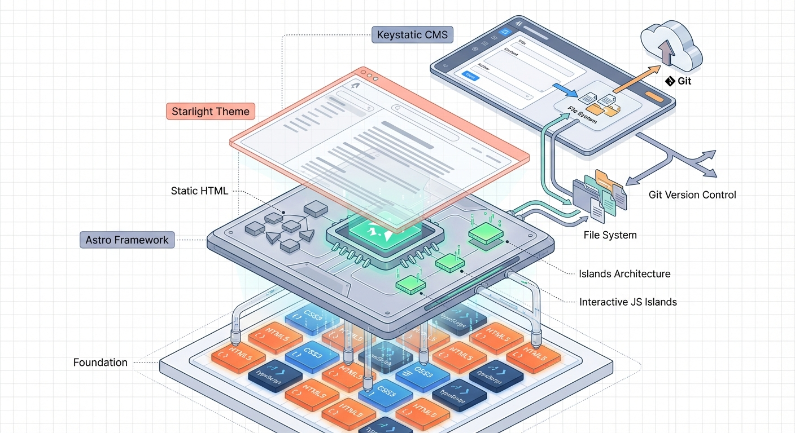

import { Card, CardGrid, Aside, Steps, Tabs, TabItem, FileTree, LinkButton } from '@astrojs/starlight/components';

Welcome, developer! This guide is designed to help you understand the technology stack behind **Nadi Kosh**, the knowledge repository powering the Nadi Stuti movement. Whether you are looking to contribute code, improve features, or fix bugs, this documentation will equip you with everything you need to get started.

>if you are an experienced developer and have worked with static site generators like astro or nextjs before, feel free to skip ahead to our future development plans section.

<LinkButton href="#future-making-writing-frictionless" icon='right-arrow'>
  Skip to Future Development
</LinkButton>

---

## Prerequisites: What You Should Know

Before diving into Nadi Kosh development, make sure you have a solid foundation in these core technologies:

<CardGrid>

  <Card title="HTML & CSS" icon="document">
    Fundamental web markup and styling. Understand semantic HTML, CSS selectors, Flexbox, and CSS Grid. You will be writing templates and styling components regularly.
  </Card>

  <Card title="Markdown & Frontmatter" icon="pen">
    Markdown is the primary language for content in Nadi Kosh. Learn YAML frontmatter syntax for defining metadata (title, date, tags, etc.) in `.md` and `.mdx` files.
  </Card>

  <Card title="TypeScript" icon="seti:typescript">
    TypeScript is used for configuration files and component logic. Strong typing helps catch errors early. You do not need to be an expert, but comfort with TypeScript types is essential.
  </Card>

  <Card title="Web Development Fundamentals" icon="node">
    Understand HTTP, DOM, async/await, modules, package managers (npm), and version control (Git). These are the foundations of all web development.
  </Card>

  <Card title="Web Standards & SEO" icon="information">
    Best practices for performant, accessible, SEO-friendly websites: semantic HTML, alt text for images, proper heading hierarchy, structured data, and meta tags.
  </Card>

</CardGrid>

<Aside type="tip">
If you are not confident in any of these areas, spend time learning them first. A solid foundation makes Nadi Kosh development much smoother.
</Aside>

---

## Foundation: Why Astro?

Nadi Kosh is built with **Astro**, a modern static site generator (SSG) framework. But why Astro? And what makes it perfect for our knowledge repository?

### What is Astro?

**Astro** is a modern web framework optimized for building fast, content-focused websites. At its core, Astro is an **island architecture** framework that:

- **Ships zero JavaScript by default.** Your static HTML, CSS, and content are sent to browsers without unnecessary JavaScript overhead.
- **Supports multiple frameworks.** You can use React, Vue, Svelte, or even plain HTML components — all in the same project.
- **Optimizes for content.** Built-in support for Markdown and MDX, perfect for blogs, docs, and knowledge bases.
- **Provides file-based routing.** Create a file in `src/pages/`, and it automatically becomes a route.

### Why We Chose Astro

At Nadi Kosh, we made a deliberate choice to use Astro for several critical reasons:

<CardGrid stagger>

  <Card title="Superior Performance" icon="rocket">
    Astro builds pure HTML at build time. Visitors download minimal JavaScript, resulting in faster page loads, better SEO rankings, and lower bandwidth usage. For a knowledge repository serving millions of potential readers, performance is non-negotiable.
  </Card>

  <Card title="Best for Static Site Generation" icon="star">
    Nadi Kosh is primarily a static wiki and blog. Astro excels at this use case far more than heavy frameworks like Next.js or Nuxt. We do not need the overhead of server-side rendering for most of our content.
  </Card>

  <Card title="Island Architecture = Broad Contributor Base" icon="list-format">
    Astro's island architecture means you can add interactive components **only where needed**, without writing complex full-stack code. A frontend developer can contribute UI improvements. A content writer does not need to touch code. This democratizes contribution.
  </Card>

  <Card title="Simplicity & Developer Experience" icon="heart">
    Astro's learning curve is gentle. If you know HTML, CSS, and a bit of JavaScript, you can start contributing to Nadi Kosh quickly. We do not want developers to fight the framework — we want them to focus on the mission.
  </Card>

  <Card title="Excellent Ecosystem" icon="npm">
    Astro integrates beautifully with Starlight (documentation theme), Markdown processing, and static hosting (Netlify, Vercel). The ecosystem is mature and well-maintained.
  </Card>

  <Card title="Future-Proof Architecture" icon="right-arrow">
    Astro is actively developed and backed by a strong community. Its architecture is designed to stay relevant as web standards evolve.
  </Card>

</CardGrid>

### Get Started with Astro

Before contributing to Nadi Kosh, we strongly recommend you **complete the official Astro tutorial**:

👉 **[Astro Tutorial - Introduction](https://docs.astro.build/en/tutorial/0-introduction/)**

This tutorial takes about 2-3 hours and covers:

- Creating your first Astro project
- Building pages with `.astro` components
- Working with Markdown
- Deploying to the web

After completing the tutorial, read the **[Astro Documentation](https://docs.astro.build/)** to deepen your understanding. Specifically:

- **[Astro Components](https://docs.astro.build/en/basics/astro-components/)** — Understanding `.astro` syntax
- **[Markdown Content](https://docs.astro.build/en/guides/markdown-content/)** — How Astro processes Markdown files
- **[Routing](https://docs.astro.build/en/basics/routing/)** — File-based routing system
- **[Data Collections](https://docs.astro.build/en/guides/content-collections/)** — Managing structured content

---

## Starlight Theme: Our Documentation Foundation

On top of Astro, we use **Starlight** — a professional documentation theme designed specifically for knowledge bases, wikis, and educational sites.

### What is Starlight?

**Starlight** is an official Astro theme that provides:

- **Beautiful, responsive documentation layouts** optimized for reading long-form content.
- **Automatic sidebar generation** from your file structure.
- **Built-in search** for readers to find content quickly.
- **Mobile-friendly design** that works perfectly on phones, tablets, and desktops.
- **Dark mode support** for comfortable reading at any time.
- **Accessibility features** ensuring your content is readable by everyone.

Starlight handles the heavy lifting of UI, navigation, and styling, letting us focus on content and plugins.

### Read the Starlight Documentation

To understand how Starlight works and how to use its features:

👉 **[Starlight Documentation](https://starlight.astro.build/)**

Key pages to read:

- **[Getting Started](https://starlight.astro.build/getting-started/)** — Overview of Starlight's capabilities
- **[Components](https://starlight.astro.build/components/cards/)** — Built-in UI components for your content (cards, callouts, tabs, code blocks, etc.)
- **[Reference](https://starlight.astro.build/reference/frontmatter/)** — Frontmatter options for pages
- **[Configuration](https://starlight.astro.build/reference/configuration/)** — How to customize Starlight

---

## Our Tech Stack

Here is the complete technology stack powering Nadi Kosh:

```
┌─────────────────────────────────────┐
│     Content Delivery (Netlify)       │
└──────────────┬──────────────────────┘
               │
┌──────────────▼──────────────────────┐
│  GitHub (Source Control)            │
│  ├─ master branch (protected)        │
│  └─ Pull requests (review & merge)   │
└──────────────┬──────────────────────┘
               │
┌──────────────▼──────────────────────┐
│  Astro (Static Site Generator)      │
│  ├─ Markdown files                   │
│  ├─ TypeScript config                │
│  └─ Component-based architecture     │
└──────────────┬──────────────────────┘
               │
┌──────────────▼──────────────────────┐
│  Starlight (Documentation Theme)    │
│  ├─ Sidebar/navigation               │
│  ├─ Components (cards, callouts...)  │
│  ├─ Plugins (blog, comments, theme) │
│  └─ Search & accessibility           │
└─────────────────────────────────────┘
```

---

## Repository Structure

Understanding our file structure is crucial for contributing effectively. Here is how Nadi Kosh is organized:

<Tabs>
  <TabItem label="Overview">

    <FileTree>
      - nadi-kosh/
        - src/
          - assets/
          - components/
             - BadgeLink.astro
             - buttons/
               - StarButton.tsx
          - content/
            - docs/
          - lib/
             - constants/ 
             - helpers/ **helper functions and files**
          - constants/
        - astro.config.mjs
        - tsconfig.json
        - package.json
        - README.md
    </FileTree>

  </TabItem>

  <TabItem label="Content Structure">

    <FileTree>
      - src/
        - content/
          - docs/
            - nadi-stuti/
              - index.md
              - mission.md
              - vision.md
            - rivers/
              - ganga.md
              - yamuna.md
              - mahanadi.md
            - books/
              - educational/
              - cleaning-guides/
              - spiritual/
            - blog/
              - inauguration-blog.md
              - another-article.md
            - thinking-grounds/
              - raw-notes-1.md
              - temporary-idea.md
            - guides/
              - development.md
              - github.md
    </FileTree>

  </TabItem>
</Tabs>
### Key Directories Explained

#### `/src/assets/`

Contains **images, logos, and static media**:

```
src/assets/
├── images/
│   ├── logo.png
│   ├── rivers/
│   │   ├── ganga-banner.jpg
│   │   └── ...
│   └── ...
└── docs/
    └── diagrams/
```

**When to add files here:** Whenever you have images or media referenced in documentation. Always optimize images for web (compress, use modern formats).

#### `/src/components/`

Contains **reusable Astro components**:

```
src/components/
├── RiverCard.astro
├── EventCard.astro
├── TeamMember.astro
└── ...
```

**When to add files here:** When you create a component that is used in multiple pages. Single-use components can live inline in pages.

#### `/src/content/docs/`

This is where **all documentation content** lives. It is organized into folders that auto-generate sidebar sections:

- **Folders with `autogenerate` enabled** (defined in `layout.ts`) will automatically create sidebar sections from all `.md` files inside. Examples: `rivers/`, `books/`, `tech/`, etc.
- **Individual pages** like `about-nadikosh.md`, `contribute.md`, `how-we-work.mdx` are manually added to the sidebar in `astro.config.mjs`.

#### `/src/content/docs/blog/`

Special folder for blog posts. Managed by the `starlight-blog` plugin. All `.md` files here become blog articles with automatic:

- Reading time estimates
- Author information
- Publication dates
- RSS feed generation

---

## Starlight Plugins We Use

Nadi Kosh is enhanced with several carefully chosen Starlight plugins:

### 1. **starlight-theme-flexoki** — The Visual Experience

**What is it?**

A premium color theme for Starlight that gives your documentation a **book or newspaper aesthetic**. It is minimal, elegant, and optimized for reading without distraction.

**Why we chose it:**

- **Distraction-free reading experience.** The theme prioritizes content over UI chrome.
- **Yellow accent color** matches our Nadi Kosh logo and branding.
- **Professional appearance** suitable for an authoritative knowledge repository.
- **Accessibility first.** The flexoki theme is designed with WCAG standards in mind.

**Configuration (in `astro.config.mjs`):**

```typescript
starlightThemeFlexoki({
  accentColor: "yellow",
}),
```

This sets the accent color to yellow throughout the site — buttons, links, highlights, and interactive elements all use this color.

**Learn more:** Flexoki is a curated, minimal color scheme. To understand the design philosophy, explore the official Starlight theme documentation.

---

### 2. **starlight-blog** — Powering Our Blog

**What is it?**

A plugin that transforms a folder of Markdown files into a **fully-featured blog system** with:

- Automatic post listings sorted by date
- Reading time estimates
- Author information and profiles
- Tags and categories
- RSS feed generation
- Archive pages

**Why we use it:**

Nadi Stuti's blog is central to our mission. We publish long-form content — essays, guides, case studies, and announcements. The `starlight-blog` plugin handles all the plumbing so we can focus on writing.

**How we configured it (in `astro.config.mjs`):**

```typescript
starlightBlog({
  title: "Nadi Stuti Blog",
  metrics: {
    readingTime: true,        // Show estimated reading time
    words: "rounded",         // Round word count (e.g., "5 min read")
  },
  authors: {
    nulligma: {
      name: "Shantanu Kulkarni",
      title: "Nadi Sevak",
      picture: "https://pbs.twimg.com/profile_images/722045969936703488/bLHK_LbW_400x400.jpg",
      url: "https://x.com/Nulligma/",
    },
    // Add more authors here as the team grows
  },
}),
```

**Key configuration options:**

- **`title`** — The blog section title shown to readers.
- **`metrics.readingTime`** — If `true`, displays "5 min read" estimates.
- **`metrics.words`** — How to round word counts ("rounded", "exact", "per-minute").
- **`authors`** — A key-value object of author profiles used in blog post frontmatter.

**How to write a blog post:**

Create a new file in `src/content/docs/blog/my-post.md` with this frontmatter:

```yaml
---
title: "My Blog Post Title"
description: "A short description that appears in preview."
date: 2026-01-13
authors:
  - nulligma
tags: ["rivers", "updates", "conservation"]
---

# My Blog Post Title

Your content here...
```

**Read the documentation:** For in-depth blog configuration, author management, and advanced features:

👉 **[Starlight Blog Documentation](https://starlight-blog-docs.vercel.app/)**

---

### 3. **starlight-giscus** — Community Comments

**What is it?**

A plugin that integrates **Giscus** — a GitHub-backed comment system — into Starlight pages. Readers can leave comments, discussions, and feedback directly on documentation pages.

**Why we added it:**

We want readers to **interact with our content**. Comments allow:

- Readers to ask clarifying questions
- Experts to add additional insights
- Errors and outdated information to be flagged quickly
- Community dialogue around important topics

Unlike traditional comment systems, Giscus uses GitHub Discussions as its backend, so comments are:

- **Public and transparent**
- **Searchable and indexable**
- **Managed through GitHub** (no external service vendor lock-in)
- **Moderable by maintainers**

**How we configured it (in `astro.config.mjs`):**

```typescript
starlightGiscus({
  repo: "nadi-stuti/kosh",              // GitHub repo
  repoId: "R_kgDOQtuzhw",               // Repo ID from GitHub
  category: "General",                  // Discussion category
  categoryId: "DIC_kwDOQtuzh84C03D7",  // Category ID
  theme: {
    light: "gruvbox_light",             // Light mode theme
    dark: "gruvbox_dark",               // Dark mode theme
    auto: "gruvbox",                    // Auto-detect based on system
  },
}),
```

**How it works:**

When a reader visits a page with comments enabled, they see:

1. A comment section at the bottom of the page.
2. Existing comments from the GitHub Discussion thread.
3. An option to sign in with GitHub and post a new comment.

**Where comments appear:**

By default, comments are enabled on all pages **except**:

- `404.md` (not found page)
- `index.mdx` (home page)

You can customize this in individual page frontmatter:

```yaml
---
title: "My Page"
# Disable comments on this page specifically
giscus: false
---
```

**Moderation:**

Since Giscus uses GitHub Discussions, moderation happens through GitHub:

1. Visit your repo's Discussions tab.
2. Review and moderate comments directly.
3. Mark answers, close discussions, etc.

**Read the guide:** For complete setup and troubleshooting:

👉 **[Starlight Giscus Guide](https://dragomano.github.io/starlight-giscus/getting-started/)**

---

### 4. **starlight-image-zoom** — Interactive Image Exploration

**What is it?**

A plugin that enables **click-to-zoom functionality** for images in your documentation. Readers can click on images to view them in a larger, fullscreen-like modal, perfect for detailed diagrams, maps, charts, and photos.

**Why we use it:**

Nadi Kosh contains many visual assets — river maps, pollution data charts, satellite imagery, historical photographs, and detailed diagrams. Static, fixed-size images limit reader experience:

- Small images are hard to read and analyze
- Readers cannot zoom into details
- Diagrams and maps lose important information

With `starlight-image-zoom`, we can:

- **Display preview-sized images** on the page (fast to load, clean appearance)
- **Allow readers to click and zoom** into the full, high-resolution version
- **Create a seamless experience** — zoom modal appears over the page, readers click to close
- **Improve readability** for users on all devices (mobile, tablet, desktop)

**How we configured it (in `astro.config.mjs`):**

```typescript
starlightImageZoom({
  // No special configuration needed — works out of the box
}),
```

The plugin is minimal and unopinionated, enabling zoom on all images by default.

**How to use it in your content:**

To enable zoom on images, **wrap them with the `.image-preview-wrapper` class**. This reduces their display size, giving them a preview appearance, while the zoom plugin allows users to expand them when clicked.

<Tabs>
<TabItem label="Markdown (.md files)">

```html
<div class="image-preview-wrapper">
  
</div>
```

**Simple and direct.** For plain Markdown content, use standard HTML `` tags wrapped in the preview class.

</TabItem>

<TabItem label="MDX (.mdx files)">

```jsx
import { Image } from 'astro:assets';
import myImage from '../../assets/prints/flex-card/hindi-back.png';

<div class="not-content image-preview-wrapper">
  <Image src={myImage} width={800} alt="Click to zoom" />
</div>
```

**For MDX**, use Astro's optimized `<Image>` component (which provides automatic optimization, srcsets, and responsive behavior).

Key points:
- **Import the image file** at the top of your MDX
- **Use `<Image>` from `'astro:assets'`** for Astro optimization
- **Add `not-content` class** to prevent Starlight content styling from interfering
- **Set a reasonable `width`** (e.g., `800`) — this is the preview size
- **Provide descriptive `alt` text** for accessibility

</TabItem>
</Tabs>

**Custom CSS for preview styling:**

We've added custom CSS in `src/styles/custom.css` to handle the preview appearance:

```css
.image-preview-wrapper {
  /* Reduce image size to create a "preview" effect */
  max-width: 400px;
  margin: 1rem auto;
  border-radius: 8px;
  overflow: hidden;
  
  /* Subtle shadow to indicate interactivity */
  box-shadow: 0 2px 8px rgba(0, 0, 0, 0.1);
  
  /* Cursor indicates images are clickable */
  cursor: pointer;
  transition: transform 0.2s ease, box-shadow 0.2s ease;
}

.image-preview-wrapper:hover {
  /* Gentle hover effect to show interactivity */
  transform: scale(1.02);
  box-shadow: 0 4px 12px rgba(0, 0, 0, 0.15);
}

.image-preview-wrapper img {
  width: 100%;
  height: auto;
  display: block;
}
```

**How it works:**

1. **Image renders small** on the page with a preview appearance
2. **User hovers over image** — subtle scale and shadow effects appear
3. **User clicks** — zoom plugin opens a modal with the full-size image
4. **User clicks modal** or pressing Escape — modal closes, back to the page

**Best practices:**

<CardGrid>

  <Card title="High-Resolution Source" icon="image">
    Always provide high-resolution images (1200px+ width). The preview shrinks them, but users see full quality when zoomed.
  </Card>

  <Card title="Descriptive Alt Text" icon="document">
    Alt text is crucial for accessibility. Describe what the image shows, not just "image" or "photo". Example: "Map of Ganga River pollution zones" or "Chart showing water pH levels over time".
  </Card>

  <Card title="Appropriate Preview Size" icon="seti:css">
    Adjust `max-width` in CSS for different content types. Maps might be 500px, while diagram details might be 300px. Test on mobile and desktop.
  </Card>

  <Card title="Image Optimization" icon="rocket">
    Use modern formats (WebP, AVIF) and compress images. Large unoptimized images slow down the entire page. Tools like TinyPNG or ImageOptim help.
  </Card>

</CardGrid>

**When to use preview + zoom:**

- **Maps and diagrams** — readers need to see details
- **Data visualizations** — charts, graphs, pollution data
- **Historical photos** — high detail and resolution matter
- **Satellite imagery** — large maps that need exploration
- **Detailed illustrations** — river ecosystems, cleanup processes

**When NOT to use preview + zoom:**

- **Logos and icons** — keep them inline, full-size
- **Decorative images** — not optimized for inspection
- **Very small images** — previewing and zooming small images is awkward

**Read the documentation:**

For advanced options and troubleshooting:

👉 **[Starlight Image Zoom Documentation](https://github.com/HiDeoo/starlight-image-zoom)**

---

## GitHub Workflow & Deployment

Our version control and deployment process is designed to ensure **quality, transparency, and safety**.

### The Master Branch Is Protected

Our **`master` branch is locked** — no one can push commits directly to it. All changes must come through **pull requests (PRs)**.

**Why?**

- **Safety.** Every change is reviewed before going live.
- **Traceability.** Clear history of who changed what and why.
- **Quality.** Code review catches bugs and improvements before deployment.

### Pull Request Workflow

Here is how to contribute code or content:

<Steps>

1. **Create a feature branch** from `master`:
   ```bash
   git checkout master
   git pull origin master
   git checkout -b feature/your-feature-name
   ```

2. **Make your changes** locally:
   - Edit Markdown files, code, components, etc.
   - Test locally: `npm run dev` starts a development server at `http://localhost:4321`

3. **Commit your changes**:
   ```bash
   git add .
   git commit -m "Clear description of what you changed"
   git push origin feature/your-feature-name
   ```

4. **Open a pull request** on GitHub:
   - Go to the repository and click "New Pull Request"
   - Set base to `master`, compare to your branch
   - Write a clear title and description
   - Request reviewers (maintainers or experts)

5. **Netlify preview** is automatically generated:
   - When you open a PR, Netlify builds a preview of the site with your changes
   - Visit the preview link to verify everything looks correct
   - Share the preview link in the PR for feedback

6. **Address feedback** from reviewers:
   - Make requested changes on your branch
   - Push them — the PR updates automatically
   - Re-request review when ready

7. **Merge when approved**:
   - A maintainer merges the PR into `master`
   - This automatically triggers a production deploy to Netlify
   - Your changes go live to `kosh.nadistuti.com`

</Steps>

### Netlify Deployment

When a PR is merged to `master`:

1. **Netlify detects the change** (via GitHub webhook)
2. **Builds the site** in ~2-5 minutes
3. **Deploys to production** automatically
4. **Your changes are live** — readers see them immediately

This means every merged PR = instant production deploy. Be careful, be thoughtful, be thorough in review!

---

## Sidebar & Navigation Configuration

Our sidebar (left navigation) is mostly **auto-generated** but requires some configuration.

### Auto-Generated Sections (Easy Mode)

Folders like `rivers/`, `books/`, `tech/`, etc. are configured in `src/lib/constants/layout.ts`:

```typescript
export const SidebarFolders = [
  {
    label: "Rivers",
    collapsed: true,
    autogenerate: {
      directory: "rivers",
      collapsed: true,
    },
  },
  {
    label: "Books",
    collapsed: true,
    autogenerate: {
      directory: "books",
      collapsed: true,
    },
  },
  // ... more folders
];
```

**How it works:**

- When you create a new `.md` file in `src/content/docs/rivers/`, it automatically appears under "Rivers" in the sidebar.
- No need to manually add it to configuration.
- Filenames become page titles (converted to Title Case).

**To add a new auto-generated section:**

1. Create a new folder in `src/content/docs/` (e.g., `new-section/`)
2. Add an entry to `layout.ts`:
   ```typescript
   {
     label: "New Section",
     collapsed: true,
     autogenerate: {
       directory: "new-section",
       collapsed: true,
     },
   }
   ```
3. Add `.md` files to the folder — they appear automatically

### Manually Configured Pages (Explicit)

Pages like `about-nadikosh`, `contribute`, `how-we-work` are added directly to `astro.config.mjs`:

```typescript
sidebar: [
  ...SidebarFolders,                              // Include auto-generated sections
  { slug: "about-nadikosh" },                     // Manual pages
  { slug: "print" },
  { label: "How we work", slug: "how-we-work" },
  { label: "Contribute", slug: "contribute" },
  { slug: "layout" },
  { slug: "updates" },
],
```

**Why manual?**

These pages are often:

- Special pages that should appear at the top level (not nested in a section)
- Not part of the main content structure
- Frequently accessed by all visitors

---

## File Structure Reference

### Adding Content (Markdown Files)

When you add a new `.md` file to `src/content/docs/`:

<Tabs>
<TabItem label="Basic Structure">

```markdown
---
title: "Page Title"
description: "Short description for search and preview"
---

# Page Title (same as frontmatter title)

Your content here...
```

</TabItem>

<TabItem label="With More Options">

```markdown
---
title: "My River Guide"
description: "Everything you need to know about the Ganga"
# Optional: Featured image
# image:
#   src: /src/assets/ganga-river.jpg
#   alt: "The Ganga River at sunrise"

# Optional: Custom sidebar label
# sidebar:
#   label: "Ganga (Complete Guide)"
---

# My River Guide

Content...
```

</TabItem>

<TabItem label="Blog Posts">

```markdown
---
title: "We Started Cleaning the Mahanadi"
description: "Our first major on-ground initiative"
date: 2026-01-13
authors:
  - nulligma
tags: ["events", "mahanadi", "ground-work"]
# Optional: featured image
# image:
#   src: /src/assets/mahanadi-cleanup.jpg
#   alt: "Volunteers cleaning the Mahanadi"
---

# We Started Cleaning the Mahanadi

Blog post content...
```

</TabItem>

</Tabs>

---

## Future: Making Writing Frictionless

Right now, writers have two paths to contribute:

1. **Technical path:** Clone the repo, install VS Code, create a branch, write Markdown with YAML frontmatter, push, open PR.
2. **Non-technical path:** Write in any editor, send the file to a maintainer, they merge it manually.

Both have friction. We are planning to solve this with a **Git-based CMS** like **Keystatic**.

### The Problem

Our **thinking-grounds** and **blog** sections need to attract many writers — experts, educators, community members, activists. But requiring:

- GitHub knowledge
- Local setup (Git, Node.js, VS Code)
- YAML frontmatter syntax
- Markdown formatting precision

...creates barriers to entry.

Writers just want to **write freely, hit publish, and move on**. They should not have to become developers.

### The Solution: Keystatic

**Keystatic** is a Git-based CMS that bridges this gap perfectly.

#### What is Keystatic?

Keystatic is a **headless CMS** that:

- Runs **in your browser** at a URL like `kosh.nadistuti.com/admin`
- **Writes to your Git repo** automatically (no separate database)
- **Generates proper YAML frontmatter** for you
- **Handles file creation and structure** automatically
- **Previews changes** before publishing
- **Manages permissions** (decide who can write, edit, publish)

#### How It Solves Our Problem

<CardGrid>

  <Card title="Zero Technical Setup" icon="star">
    Writers visit a URL, sign in, and start writing. No Git, no terminal, no config files.
  </Card>

  <Card title="Automatic Frontmatter" icon="seti:markdown">
    Keystatic generates proper YAML metadata (title, date, author, tags) through a form. Writers never touch YAML.
  </Card>

  <Card title="Visual Editor" icon="seti:word">
    Write in a rich text editor, see a live preview, and publish with one click. All markdown is generated correctly.
  </Card>

  <Card title="Git Workflow Preserved" icon="seti:git">
    Behind the scenes, Keystatic still uses Git branches and PRs. Your code review process is intact.
  </Card>

  <Card title="Permission Control" icon="seti:lock">
    Configure who can write, edit, publish, and delete. Maintain editorial control even with open contributions.
  </Card>

</CardGrid>


### Keystatic Editor Workflow

.png)

Keystatic transforms content editing into a **zero-friction, three-step process** — no terminal, no code, no confusion.

#### Step 1 — The Editor's Desk (Writing)

A non-technical writer opens the **Keystatic Admin UI** — a clean, browser-based interface that looks and feels like any modern writing tool (think Notion or Google Docs). They see their articles listed, click **"New Article"**, type their content into a rich text editor, fill in a simple form for metadata (title, description, tags), and hit **Save**.

Under the hood, Keystatic **writes directly to the file system** — creating a `.md` or `.mdx` file in the correct content folder automatically. The writer never sees YAML frontmatter. They never open a terminal. They never touch a file path.

> **The writer's experience:** Open browser → Write → Save. Done.

#### Step 2 — The Backend (Git Does the Heavy Lifting)

When the writer saves their content, Keystatic automatically performs a **Git Commit and Push** in the background. The new article is uploaded to the Git repository as a proper branch (e.g., `New-Article-A` or `Edit-Topic-B`), separate from the live `Wiki-Live` branch.

This means:
- **No database is needed.** All content lives as plain text files (`.md` / `.mdx`) inside the Git repository.
- **Every edit is versioned.** Git tracks every change, who made it, and when — giving you a full audit trail by default.
- **Multiple writers can work in parallel** on isolated branches without stepping on each other.

The Git branch structure looks like this:

```md
Wiki-Live (production)
└── develop
├── New-Article-A ← New contribution
└── Edit-Topic-B ← Edit to existing page
```

### Step 3 — Review, Build & Deploy

Once a writer submits their article, it enters a **review pipeline**:

1. A maintainer reviews the proposed changes (via a Pull Request or Keystatic's own review tools).
2. The **Astro Build Engine** picks up the Markdown/MDX files and compiles them into **static HTML**.
3. Upon approval, the built site is **deployed to the server** — the Live Version of the wiki is updated.

Writers get feedback. Maintainers stay in control. Nothing goes live without review.

> **The net result:** A community member in a village, an expert botanist, a river activist — anyone can contribute knowledge to NadiKosh without ever learning Git, Node.js, or Markdown syntax.

---

###  Our Tech Stack: How It All Fits Together


NadiKosh is built on a carefully layered architecture where each layer serves a distinct purpose. From the ground up:

### Layer 1 — The Foundation
At the very base sits the **web's fundamental trio**: **HTML5**, **CSS3**, and **TypeScript**. These are the raw building blocks — structure, style, and type-safe logic — that everything above depends on.

### Layer 2 — Astro Framework
Sitting above the foundation is the **Astro Framework**, which acts as the core engine. Astro brings two powerful ideas:

- **Islands Architecture** — The page is mostly static HTML, but isolated "islands" of interactivity (like a search box or a quiz) are hydrated with JavaScript only where needed. This keeps the site blazing fast.
- **Interactive JS Islands** — React components can be selectively embedded into otherwise static pages, giving us dynamic features without sacrificing performance.

Astro reads all content from the **File System** — the `.md` and `.mdx` files that Keystatic creates and manages.

### Layer 3 — Starlight Theme
On top of Astro sits the **Starlight Theme** — Astro's official documentation/wiki theme. It gives NadiKosh its polished wiki look: sidebar navigation, table of contents, search, multi-language support, and responsive layout — all out of the box. The output is pure **Static HTML**, which means the site loads instantly for any reader anywhere.

### Layer 4 — Keystatic CMS (The Editor's Gateway)
Floating above the entire system is **Keystatic CMS**, which connects directly to the **File System**. This is the bridge between human writers and the codebase. Keystatic reads and writes files to the same directory that Astro builds from — meaning what a writer saves in the CMS immediately becomes part of the site's content source.

Keystatic then syncs those file changes upward to **Git Version Control**, maintaining a full history of every article, every edit, every contributor — all without a single database.

---

## The Complete Picture: How Everything Works Together

Here is how a single piece of content — say, an article about the Netravati River — flows through the entire system:

```md
Writer opens Keystatic UI (browser)
↓
Writes article in rich-text editor (no code)
↓
Keystatic saves → .mdx file written to /src/content/our-rivers/
↓
Git commits & pushes to a new branch on GitHub
↓
Maintainer reviews the Pull Request
↓
On approval → Astro Build Engine runs
↓
Starlight Theme renders the MDX into Static HTML
↓
Deployed to server → Article is LIVE on NadiKosh
```


### Why This Stack Is Perfect for NadiKosh

| Concern | How Our Stack Solves It |
|---|---|
| Non-technical contributors | Keystatic Admin UI — no code needed |
| Content versioning & safety | Git tracks every change, forever |
| No database overhead | All content lives as `.md`/`.mdx` files |
| Fast loading for all readers | Astro outputs pure static HTML |
| Beautiful wiki structure | Starlight Theme with sidebar, ToC, search |
| Selective interactivity | Astro Islands for quizzes, maps, live data |
| Type-safe content schemas | TypeScript + Keystatic config validates every field |

The architecture is deliberately **simple, durable, and open**. There is no proprietary database to migrate, no expensive hosting plan, and no vendor lock-in. The entire knowledge base of NadiKosh lives as readable text files in a Git repository — meaning it can be archived, forked, mirrored, or moved at any time, ensuring the knowledge of India's sacred rivers is never lost to a platform shutdown.


#### How Keystatic + Thinking Grounds Would Work

**Current flow (manual + friction):**

```
Writer → Writes in Obsidian/Typora
       → Sends .md file to Content Creator group
       → Maintainer manually creates frontmatter, adds to repo + creates PR
       → Reviewer approves
       → Merged to master
       → Deployed
```

**Keystatic flow (streamlined + delightful):**

```
Writer → Opens kosh.nadistuti.com/admin
       → Clicks "New Note in Thinking Grounds"
       → Fills form: Title, Content, Tags, Author
       → Clicks "Save as Draft"
       → Clicks "Publish"
       → Keystatic creates branch + PR automatically
       → Reviewer approves PR on GitHub
       → Merged to master
       → Deployed
```

The difference?

- **Writers never see Git or YAML or frontmatter.** They see a friendly form.
- **Publishing is instant** — not "send to maintainers and wait."
- **Wrong frontmatter** Maintainer might add wrong frontmatter that writers didnt want
- **Mistakes are caught at review** (PR review, not manual formatting).
- **History is preserved** (Git commits show who wrote what, when).

#### Keystatic Architecture

```
┌─────────────────────────────────────┐
│  Writer (Browser)                   │
│  Visit: /admin                      │
└──────────────┬──────────────────────┘
               │
┌──────────────▼──────────────────────┐
│  Keystatic CMS                      │
│  ├─ Visual editor                    │
│  ├─ Form-based metadata              │
│  └─ Preview                          │
└──────────────┬──────────────────────┘
               │ (Creates branch + commits)
┌──────────────▼──────────────────────┐
│  GitHub                             │
│  ├─ Creates feature branch           │
│  ├─ Writes .md file with frontmatter │
│  └─ Opens PR                         │
└──────────────┬──────────────────────┘
               │ (Reviewer approves)
┌──────────────▼──────────────────────┐
│  master branch                      │
│  ├─ PR merged                        │
│  └─ Webhook triggered                │
└──────────────┬──────────────────────┘
               │
┌──────────────▼──────────────────────┐
│  Netlify                            │
│  ├─ Build & Deploy                  │
│  └─ Site goes live                  │
└─────────────────────────────────────┘
```

#### Implementation Plan

To implement Keystatic for Nadi Kosh:

<Steps>

1. **Install Keystatic** in the Astro project:
   ```bash
   npm install @keystatic/core @keystatic/next
   ```

2. **Create a Keystatic config file** (`keystatic.config.ts`) that defines:
   - Collections (blog, thinking-grounds)
   - Fields (title, content, author, date, tags)
   - Permissions (who can write/publish)

3. **Set up GitHub OAuth** so writers can sign in securely via GitHub.

4. **Deploy the admin panel** at a route like `/admin` on Netlify.

5. **Configure Keystatic to create PRs**:
   - Writers publish → creates draft PR automatically
   - Maintainers review + merge → goes live

6. **Test thoroughly** before rolling out to non-technical contributors.

</Steps>

#### Benefits for Writers

- **No Git knowledge required**
- **No local setup** (just a browser)
- **Instant feedback** (see preview before publishing)
- **Clear workflow** (draft → review → publish)
- **Mobile-friendly** (write on your phone if needed)

#### Benefits for Maintainers

- **Code review still happens** (via GitHub PRs)
- **Full audit trail** (Git history preserved)
- **Quality control** (can reject/request changes before merge)
- **Scalability** (handle many writers without manual formatting work)
- **Flexibility** (Keystatic is headless — can integrate with other systems)

#### Next Steps

This is on our roadmap but not yet implemented. When you see the Keystatic admin panel go live, it will be a major milestone for Nadi Kosh. Suddenly, contributing will feel as easy as tweeting — and that is exactly what we want.

You also don’t have to wait for us to implement this alone.

If you are a developer who enjoys working on **content tooling, DX, or CMS integrations**, this is a beautiful area to contribute:

- You can help us **design and implement the Keystatic setup** (collections, schemas, workflows, GitHub OAuth).  
- You can experiment with **better CI/CD flows** for writers, preview builds, and editorial review.  
- You can propose improvements to our **Astro / Starlight / plugin architecture** so that Nadi Kosh remains simple to maintain even as it grows.

If this excites you, please:

1. Join our **Tech Group** in the Nadi Stuti WhatsApp community (link on **nadistuti.com**).  
2. Introduce yourself, share your experience with CMS / Astro / Git workflows, and mention that you are interested in the **Keystatic + writing experience** track.  

We are very open to ideas. Whether you want to lead the Keystatic integration, review our current stack, or suggest alternative approaches, your insight can shape how hundreds of future writers interact with Nadi Kosh.


---

## Contribution Workflow Summary

Here is the complete journey from idea to published content:

<Steps>

1. **You have an idea** (article, code fix, design improvement)

2. **Discuss it** (optional but recommended):
   - Chat in our WhatsApp community
   - Open an issue on GitHub
   - Get feedback from maintainers

3. **Set up locally**:
   ```bash
   git clone https://github.com/nadi-stuti/kosh.git
   cd kosh
   npm install
   npm run dev
   ```

4. **Create a feature branch**:
   ```bash
   git checkout -b feature/your-feature-name
   ```

5. **Make your changes**:
   - Edit Markdown files
   - Add/modify components
   - Update configuration
   - Test in your browser (`http://localhost:4321`)

6. **Commit and push**:
   ```bash
   git add .
   git commit -m "Clear, descriptive commit message"
   git push origin feature/your-feature-name
   ```

7. **Open a pull request** on GitHub:
   - Request review from maintainers
   - Reference any related issues
   - Netlify generates a preview — check it!

8. **Respond to feedback**:
   - Make requested changes
   - Push updates to the same branch
   - Comment when ready for re-review

9. **Get merged**:
   - Maintainer approves and merges your PR
   - Netlify auto-deploys
   - Your contribution is live! 🎉

</Steps>

---

## Getting Help

As you start contributing, you might have questions:

<CardGrid>

  <Card title="GitHub Issues" icon="github">
    Found a bug or have a feature request? Open an issue on GitHub with clear description and steps to reproduce.
  </Card>

  <Card title="Pull Request Discussions" icon="down-arrow">
    During your PR review, ask clarifying questions. Maintainers are here to help.
  </Card>

  <Card title="WhatsApp Community" icon="comment">
    Join our Tech Group for real-time chat, debugging help, and discussion with other developers.
  </Card>

  <Card title="Documentation" icon="open-book">
    This guide, Astro docs, Starlight docs, and plugin docs are comprehensive. Search first!
  </Card>

</CardGrid>

---

## Final Words

Welcome to the Nadi Kosh developer community.

We are building something meaningful — a knowledge repository that will serve millions of people, help clean our rivers, and preserve India's sacred legacy for generations to come.

Your contribution, no matter how small, matters.

Whether you fix a typo, write a component, improve performance, or answer a fellow developer's question — you are part of this movement.

We are grateful for you. Thank you for being here.

**Happy coding, and may your contributions flow like a river.** 🌊

---
