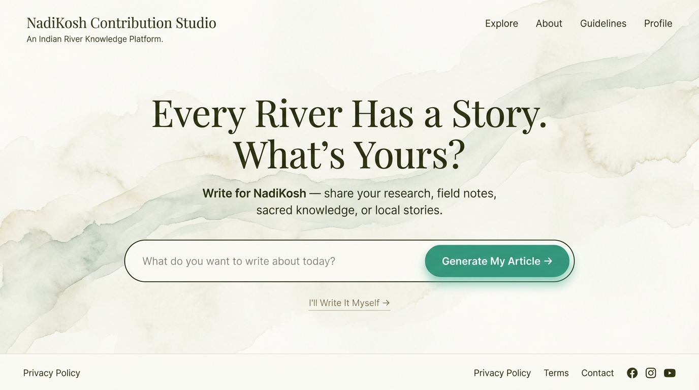
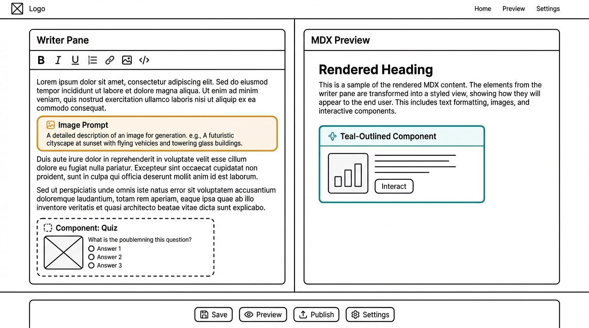

import { Tabs, TabItem, LinkButton } from '@astrojs/starlight/components';

> **Every river needs a voice.** This document outlines the Proof of Concept (POC) for **Contribution Studio** — an AI-assisted article creation platform that empowers anyone working toward river conservation to generate rich, beautifully structured articles and share them with thousands on Nadikosh

---

## What Are We Building?

Contribution Studio is an AI-assisted article creation tool built inside the Nadikosh Astro + Starlight wiki at the route /contribute. It allows any contributor — regardless of technical background — to write structured, component-rich MDX articles for the Nadikosh river knowledge base.

It is a platform where **field workers, researchers, historians, students, activists, and community leaders** can have a structured conversation with AI about problems they're witnessing or researching related to rivers — then generate a complete, publication-ready article series.

<LinkButton href="/#write-for-nadikosh" target="_blank"> Check out the demo </LinkButton>

### Target Audience

The target contributor is NOT a developer. They could be:

- A **ground worker** who has seen illegal sand mining damage a riverbed
- A **researcher** who wants to document the lack of testing equipment in India
- A **professor** wanting to educate people about river water quality
- A **historian or saint** writing about the sacred history of a river
- A **local activist** documenting river-related policies and violations
- A **fisherman or boat worker** recording how river changes affect their livelihood
- An **Ayurveda practitioner** connecting river health to human health
- A **photographer or videographer** documenting visual evidence of pollution
- A **student** working on an environmental dissertation
- A **panchayat member or government official** reporting governance issues
- A **diaspora Indian** documenting their ancestral river's history

The Studio removes all technical friction. A contributor types an idea, the AI drafts a full article with components and image prompts, the contributor edits it in a friendly editor, and downloads a ready-to-publish `.mdx` file.

### The Vision

Imagine a **ground worker** in the Yamuna basin discovers illegal sand mining damaging river beds. They come to Nadikosh, describe the problem in plain language, and within minutes get:

- ✅ A 5–10 article series on sand mining impacts
- ✅ Inline suggestions for interactive charts showing mining trends
- ✅ Image prompts ready for visualization
- ✅ Component recommendations (data comparison, before/after sliders, educational quizzes)
- ✅ A clean, publication-ready MDX file they can share

All **without having great writng skill, writing code or understanding components**.

<LinkButton href="/pollution-library/why-rivers-are-polluted/" target="_blank"> View sample AI generated article </LinkButton>

---

## The Problem We're Solving

### Current State: High Barriers to Knowledge Sharing

**Who wants to write about rivers but faces friction?**

| Audience                         | Their Challenge                                                          | Impact                                              |
| -------------------------------- | ------------------------------------------------------------------------ | --------------------------------------------------- |
| 🏗️ Ground Workers                | Lack writing skills, time to structure content                           | River issues stay local, undocumented               |
| 🔬 Researchers                   | Unsure how to translate technical findings into accessible stories       | Research impact limited to academic circles         |
| 👨‍🏫 Professors                    | Want to teach river science but materials are scattered or outdated      | Students use fragmented sources                     |
| 📜 Historians & Saints           | Sacred knowledge about rivers isn't digitized or organized               | Cultural knowledge at risk of loss                  |
| 👨‍💼 Policy Advocates              | Want to publish policy analysis but lack visual/interactive tools        | Arguments stay text-heavy, harder to engage readers |
| 👨‍🎓 Students                      | Working on environmental projects but need platforms to publish findings | Work disappears after semester ends                 |
| 📸 Photographers & Videographers | Have powerful visual evidence of pollution but no narrative structure    | Images lack context, message doesn't stick          |
| 🎯 Diaspora Indians              | Emotionally connected to ancestral rivers but don't know where to start  | Global perspective on Indian rivers stays untapped  |

### What Contribution Studio Fixes

:::tip[Why This Matters]
Contribution Studio **lowers the barrier from "having a story" to "publishing a story."** It flips the question from "How do I write this?" to "What do I want to say?" The platform handles structure, visualization, and publication.
:::

---


## POC Overview

### Tech Stack

| Layer | Technology | Notes |
|-------|-----------|-------|
| Framework | Astro SSR (existing Nadikosh) | Needs SSR adapter: `@astrojs/node` or `@astrojs/vercel` |
| Island | React `client:load` | Contribution Studio is one large React island |
| Rich Text Editor | TipTap | Writer-friendly, supports custom nodes for components |
| AI API | Anthropic Claude API | Via Astro API route `/api/generate-article` |
| Component Props UI | Custom form builder | Labeled fields — no raw JSON exposed to user |
| Animations | Motion for React (`motion`) | `npm install motion`, import from `motion/react` |
| Styling | Existing Nadikosh theme (Flexoki) | Starlight + starlight-theme-flexoki |
| Publishing (POC) | Download `.mdx` file | User manually adds to Git repo |
| Publishing (Stretch) | GitHub PR bot | Auto-creates PR with MDX file |
| CMS Eval (Parallel POC) | KeyStatic / DecapCMS / PageCMS | Separate investigation track |

### Landing Page Experience



- **Process 1** (Auto Generate) → Claude AI writes article from idea
- **Process 2** (Manual) → User writes manually in editor

### The Two Processes — Overview

Think of the Contribution Studio landing page like the Google homepage: deliberately minimal, but hiding enormous power behind that simplicity.

---

#### Process 1 — "AI-Guided Writing" (The Main Path)

**Who it's for:** Anyone with a raw thought — a ground worker who saw illegal sand mining, a saint who wants to document sacred river texts, a student with a pollution report idea.

**Flow:**

1. User lands on the page and sees the prompt: _"What do we want to write about today?"_
2. They type their raw idea in natural language — no structure needed
3. They hit **"Generate My Article"**
4. Claude API receives the idea bundled with your full instruction context (component list, article guide, Nadikosh sections)
5. The MDX editor opens with a fully drafted article — headings, paragraphs, inline image prompt callouts, and component suggestion cards already placed inside the text
6. User reviews, edits text, swaps components via the form panel, refines image prompts
7. Hits **"Download MDX"** → gets a ready `.mdx` file or **Publish** -> Auto publishes the article on our NadiKosh

**The key experience:** The writer never sees raw MDX code. They see a living document with friendly callout blocks where images and components will go.

---

#### Process 2 — "Write It Yourself" (The Manual Path)

**Who it's for:** An expert researcher, professor, or historian who already knows exactly what they want to say and just needs a structured, power-assisted editor to write it in.

**Flow:**

1. User clicks **"I'll Write It Myself →"** (see button text below)
2. A section selector appears — _"Which part of Nadikosh are you writing for?"_ (River Science / Sacred Rivers / Field Reports / Policies / Tech \& Tools)
3. The MDX editor opens **empty but section-aware** — the toolbar and component suggestions are pre-filtered for the chosen section
4. Writer types freely, inserts components from the panel when needed, adds image prompt callouts manually
5. Hits **"Download MDX"** → same output as Process 1

**The key experience:** Full creative control, but with smart guardrails — the right components are already surfaced, the right Nadikosh frontmatter is pre-filled, nothing is locked.

---

## 4. The Hybrid Editor (Core Feature)

This is the most important component of the entire POC. Both processes converge here.

### Layout



### Key Editor Features

**Component Insertion**
- Clicking "Insert Component" opens a slide-in panel
- Contributor picks from the Nadikosh component library (20 components: Quiz, Charts, Maps, Sliders, etc.)
- A **form-based prop editor** (labeled fields, NO raw JSON) appears for the selected component
- On confirm, a visual **component card** is inserted into the editor at cursor position
- Raw MDX spec block is hidden from the writer but included in the exported MDX

**Image Prompt Callouts**
- Displayed as styled orange/yellow callout blocks in the editor
- NOT shown as raw text — they look like a hint card
- One-click copy button on each prompt
- Tooltip: *"Paste this into Gemini or DALL-E to generate your image. Full version will have built-in image editor."*

**MDX Export**
- "Download MDX" button generates a complete `.mdx` file with:
  - Correct Astro + Starlight frontmatter
  - Prose content
  - Component spec blocks (as per `article_generation_guide.md` format)
  - Image prompt comments
  - Series metadata (if linked)

---

## Core Components

### 1. Hybrid MDX Editor

- **Left pane:** TipTap writer-friendly editor (no raw code visible)
- **Right pane:** Live MDX preview
- **Image prompts** displayed as styled callouts (copy-to-Gemini buttons)
- **Component panel:** Form-based interface to insert and edit components

### 2. Claude Integration

- **Master system prompt** (3 layers, ~7000–9000 chars)
- **API route:** `/api/generate-article`
- **Input:** User idea + selected article type
- **Output:** Complete MDX string with component slots + metadata

### 3. Component Library Panel

- Dropdown to select component type (Quiz, BarChart, ZoneMap, etc.)
- Form fields for each prop (labeled, no raw JSON)
- Preview of component before insertion
- Edit existing components inline

### 4. Download & Publish

- **Bare minimum:** Download `.mdx` file button
- **Stretch:** GitHub PR bot OR KeyStatic/DecapCMS integration

---

## Bare Minimum POC (MVP) ✅

**What must work for MVP success:**

- [ ] `/contribute` page in Nadikosh (Astro SSR, `client:load` island)
- [ ] Landing UI: textbox + "Manual Writing" button
- [ ] Process 1: Idea submission → Claude API → MDX in editor
- [ ] Process 2: Manual mode opens empty editor with section selector
- [ ] Hybrid Editor: TipTap left, plain text preview right
- [ ] Image prompts render as styled callouts
- [ ] Component picker with 3 sample components (Quiz, BarChart, ZoneMap)
- [ ] Form-based prop editors (no raw JSON visible)
- [ ] Component insertion creates visual cards in editor
- [ ] Download `.mdx` file with valid frontmatter and component specs
- [ ] All 5 persona types tested with Claude

---

## Good-to-Complete POC 🚀

**Elevates MVP into a demo-ready product:**

- [ ] Master system prompt fully optimized (all files condensed + tested)
- [ ] All 20 components have form-based editors
- [ ] Live preview actually renders Astro components (iframe sandbox)
- [ ] Image prompts copyable with one-click (Gemini, Midjourney tooltips)
- [ ] Contributor persona selector (adjusts Claude tone/structure)
- [ ] Article section selector (feeds context to Claude)
- [ ] Series linking UI (connect articles to existing series in Nadikosh)
- [ ] GitHub PR bot (submit MDX directly)
- [ ] CMS POC evaluation (KeyStatic vs. DecapCMS vs. DecapCMS)
- [ ] Mobile-friendly editor layout
- [ ] User accounts + saved drafts (optional)

---

## Architecture Deep Dive

### System Layers

<Tabs>
<TabItem label="API Layer">

**Endpoint:** `POST /api/generate-article`

```typescript
// Request
{
  userIdea: string;        // "Sand mining damaging Yamuna beds"
  articleType: string;     // "investigative" | "educational" | "policy" | "sacred"
  personaType: string;     // "ground_worker" | "researcher" | "historian"
  sectionId?: string;      // "pollution" | "conservation" | "culture"
}

// Response
{
  mdxContent: string;      // Full MDX with component slots
  imagePrompts: string[];  // ["Satellite view of sand mining...", ...]
  suggestedComponents: {   // [{ id: "quiz", title: "Quiz", props: {...} }, ...]
    id: string;
    title: string;
    props: Record<string, unknown>;
  }[];
  metadata: {
    wordCount: number;
    estimatedReadTime: number;
    articleStructure: string[];
  };
}
```

**Claude API call strategy:**

- Send master system prompt (always)
- Send only relevant file sections based on `articleType`
- Limit context to ~9000 chars total
- Stream response for real-time UI updates

</TabItem>

<TabItem label="Editor Layer">

**TipTap + MDX rendering**

```typescript
// Editor state
interface EditorState {
  content: string;           // Raw MDX
  components: ComponentNode[]; // Inserted components
  imagePrompts: ImagePrompt[];
  metadata: ArticleMetadata;
}

interface ComponentNode {
  id: string;
  type: "quiz" | "chart" | "map" | ...;
  props: Record<string, unknown>;
  position: number; // In document
}

// Component insertion creates:
// [Insert React Component Here]
// **Component**: [category-ID] ComponentName
// **Props**: { ...JSON... }
```

**TipTap extensions:**

- Custom component node type
- Image prompt callout block
- Markdown link handling for series

</TabItem>

<TabItem label="Data Storage">

**Right now:** Articles stored in Git (Starlight repo)

**Problem:** Component JSON data bloats file size; client-side rendering expensive.

**POC explores:** MongoDB document store for components

```typescript
// Component Templates (pre-built)
db.componentTemplates.insertOne({
  _id: "quiz-template-1",
  componentId: "interactive-1",
  name: "QuickKnowledgeCheck",
  category: "interactive",
  defaultProps: {
    title: string;
    questions: { text: string; options: string[]; correct: number }[];
  },
});

// User-Created Components (article-specific)
db.userComponents.insertOne({
  _id: ObjectId(),
  articleId: "article-sand-mining-yamuna",
  componentId: "quiz-yamuna-v1",
  type: "interactive-1",
  props: {
    title: "How much sand is mined daily?",
    questions: [
      {
        text: "Estimate daily sand extraction from Yamuna...",
        options: ["100 tons", "1000 tons", "10,000 tons"],
        correct: 2,
      },
    ],
  },
  createdAt: ISODate(),
  authorId: "ground_worker_xyz",
});
```

**Benefit:** Decouple component data from article files; query components separately; reuse across articles.

</TabItem>
</Tabs>

---

## Claude API — Context Optimization Strategy

A sample on how to use claude API:

### Master System Prompt (always sent)

**~2000 chars** — core identity + output format rules

```
You are an AI article generation assistant for Nadikosh, a collaborative river knowledge base.

Your role: Convert user ideas about river problems into rich, publication-ready MDX articles.

Output format:
- Markdown with embedded component slots
- Format: [Insert React Component Here]
- Followed by component spec block with JSON props
- Image prompts as callout blocks: #Image prompt: "..."

Never hardcode data. Always generate flexible, reusable components.
```

### Layer 2: Component Registry (always sent)

**~3000 chars** — condensed checklist + specs

```
## Available Components

[interactive-1] Quiz: Multiple choice knowledge checks
[interactive-2] ProgressiveReveal: Step-by-step story revealing
[infographic-1] LineChart: Trend visualization
[infographic-2] BarChart: Category breakdown
[multimedia-1] ZoneMap: Geographic data
[multimedia-2] ImageSlider: Before/after comparison

[Component specs available on request — provide exact JSON schema]
```

### Layer 3: Article Guide (conditional)

**~2000–4000 chars** — only if article type requires it

- If data-heavy → send `nivo-infographic.md` (condensed)
- If geography → send `multimedia.md` (condensed)
- If interactive → send `interactive-components.md` (condensed)
- If river pollution → send `article_generation_guide.md` (condensed)

**Total per call: ~7000–9000 chars** ✅

---

## Possible Additional POCs (Parallel Tracks)

As you build Contribution Studio, consider these related POCs:

:::note[Not Required for MVP]
These are **parallel explorations**, not blockers. Pick one that interests you.
:::

### POC 1: Git-Based CMS for Nadikosh

**Problem:** How do we publish user-generated MDX to Nadikosh without manual merges?

**Options:**

- **GitHub PR Bot** — User clicks "Publish" → bot creates PR with MDX file
- **KeyStatic** — Headless CMS integrated with Astro + Git
- **DecapCMS** — Open-source CMS with Git backend

**Deliverable:** Test one option end-to-end with a real article.

```
User writes article → Clicks "Publish" → PR auto-created → Maintainer reviews → Merged to main → Live on Nadikosh
```

### POC 2: Component Data Storage (MongoDB)

**Problem:** Storing component JSON in Git bloats the repo; harder to query/reuse components.

**Solution:** Decouple component data from articles.

```typescript
// Store in MongoDB
db.articles.insertOne({
  slug: "sand-mining-yamuna",
  title: "...",
  content: "MDX with [component-ref: quiz-yamuna-v1]",
  componentRefs: ["quiz-yamuna-v1"], // Links to external data
});

db.components.insertOne({
  _id: "quiz-yamuna-v1",
  type: "interactive-1",
  props: {
    /* large JSON */
  },
});

// Articles stay lightweight; components fetched on-demand
```

**Deliverable:** Schema design + one working example.

### POC 3: Image Generation Integration

**Problem:** We suggest image prompts, but users copy-paste to Gemini manually.

**Solution:** Integrate Gemini API directly into editor.

```typescript
User clicks "Generate Image"
→ Sends prompt to Gemini API
→ Returns 4 options
→ User selects one
→ Inserts image reference into MDX
```

**Deliverable:** Gemini API integration in editor (if free tier available) OR mock UI showing what it would look like.

### POC 4: Series Generation (Recursive)

**Problem:** MVP generates single articles; user wants 5–10 article series.

**Solution:** Recursive AI workflow — generate outline → generate each article → link articles.

```
User: "I want to write about how climate change impacts monsoon patterns"
↓
Claude generates: 5-article series outline
↓
For each article:
  - Generate MDX
  - Suggest components
  - Generate image prompts
↓
Link all articles with prev/next navigation
```

**Deliverable:** Outline generation + proof that recursion doesn't explode Claude costs.

### POC 5: Contributor Analytics Dashboard

**Problem:** How do we know if Contribution Studio is working? Who's using it?

**Solution:** Simple analytics dashboard.

```
- Total articles generated
- By persona type (researcher, activist, etc.)
- Topics covered
- Component usage stats
- Time to publish (draft → published)
```

**Deliverable:** Basic analytics UI + database schema.

---

## Build Order by Role

### 🎨 Frontend Developers

**Sprint 1:**

1. Create `/contribute` route in Nadikosh
2. Build landing UI (textbox + button)
3. TipTap editor integration (left pane)

**Sprint 2:** 4. Right pane preview (live MDX render) 5. Component picker panel UI 6. Form-based prop editors

**Sprint 3:** 7. Mobile-responsive layout 8. Editor state management (Redux/Zustand)

### 🔧 Backend Developers

**Sprint 1:**

1. Set up Astro SSR adapter (if not done)
2. Create `/api/generate-article` route
3. Anthropic API integration (basic call)

**Sprint 2:** 4. Master system prompt design + testing 5. Error handling & rate limiting 6. Streaming responses for real-time UI

**Sprint 3:** 7. GitHub PR bot integration (optional) 8. CMS evaluation + integration

### 🤖 AI/Prompt Engineers

**Sprint 1:**

1. Condense all 11 instruction files into 3-layer master prompt
2. Test with 5 persona types
3. Tune output format for clean MDX

**Sprint 2:** 4. Build component suggestion logic (when to recommend which components) 5. Image prompt generation quality refinement 6. Error recovery (if Claude response is malformed)

**Sprint 3:** 7. Test across 8+ user types 8. Optimize for different article types (investigative vs. educational)

### 📊 Data/Database Developers

**Sprint 2–3:**

1. Design MongoDB schema (component templates vs. user components)
2. Build API layer for component queries
3. Migration strategy (Git → MongoDB for existing articles)

### 📝 Documentation & Testing

**Ongoing:**

1. Write POC setup guide
2. Test with real contributors (ground workers, researchers, students)
3. Gather feedback
4. Document what works / what doesn't

---

## Developer Contribution Guidelines

### How to Contribute

This is an **open, collaborative POC**. You don't need permission to start. Here's how:

:::tip[You're Free to Contribute!]
Whether you have 1 hour or 10 weeks, your contribution is valuable. No deadline pressure, no bureaucracy.
:::

#### Pick a Task

Choose from:

- **Full features** — Build an entire component (2–4 weeks)
- **Partial features** — Build one aspect (1–2 weeks)
- **Documentation** — Write guides, share learnings (3–5 days)
- **Bug fixes** — Find and fix issues (1–3 days)
- **Optimization** — Improve existing code (1–2 weeks)

#### Share Your Learning

Write a short post / comment about:

- Challenges you faced
- Solutions you found
- Architectural decisions
- What you'd do differently

---

### What This Is NOT (POC Scope Limits)

- ❌ Not a multi-user platform (no auth in bare minimum POC)
- ❌ Not a full CMS (file download only in bare minimum)
- ❌ Not integrated with Nadikosh article series recursively (single article only)
- ❌ No built-in image generation (image prompts only, user uses Gemini externally)
- ❌ No real-time collaboration

---

## Technical Stack

<Tabs>
<TabItem label="Frontend">

- **Framework:** Astro (SSR) + React (client:load island)
- **Editor:** TipTap (rich text, extensible)
- **Preview:** Plain text or iframe-sandboxed Astro component
- **State:** Zustand or Redux (your choice)
- **Styling:** Tailwind CSS (match Nadikosh theme)
- **Build:** Vite (Astro default)

</TabItem>

<TabItem label="Backend">

- **Runtime:** Node.js (Astro SSR)
- **API route framework:** Astro API routes
- **AI:** Anthropic Claude API (Sonnet 3.5 recommended)
- **Database:** MongoDB (optional, for POC 2)
- **Git integration:** Octokit (GitHub API for PR bot)

</TabItem>

<TabItem label="DevOps">

- **Version control:** Git + GitHub
- **Deployment:** Vercel or Netlify (Astro-friendly)
- **Env vars:** `.env` file locally, Vercel secrets in prod
- **Monitoring:** Basic error logging (Sentry optional)

</TabItem>
</Tabs>

---

## FAQ

:::note[Frequently Asked Questions]
Got questions? Here are common ones.
:::

**Q: Do I need to know Claude API?**  
A: No. If you're frontend-focused, do UI. If you're backend-focused, we have an AI engineer guiding the prompt strategy.

**Q: Can I work on just one component?**  
A: Absolutely. Pick one component type (e.g., "Form-based editor for the Quiz component") and own it.

**Q: What if I can only contribute few hours?**  
A: Perfect. Write documentation, create example components, or fix one bug. Every contribution counts.

**Q: Can I work on the Git CMS or MongoDB POC instead?**  
A: Yes! Those are equally valuable. Pick whichever interests you.

---

## Resources

- 📖 [Astro SSR Docs](https://docs.astro.build/en/guides/server-side-rendering/)
- 📖 [TipTap Docs](https://tiptap.dev/)
- 📖 [Claude API Docs](https://anthropic.com/claude/api)
- 📖 [Starlight Docs](https://starlight.astro.build/)
- 🎥 [Astro Islands Explained](https://docs.astro.build/en/concepts/islands/)

---
