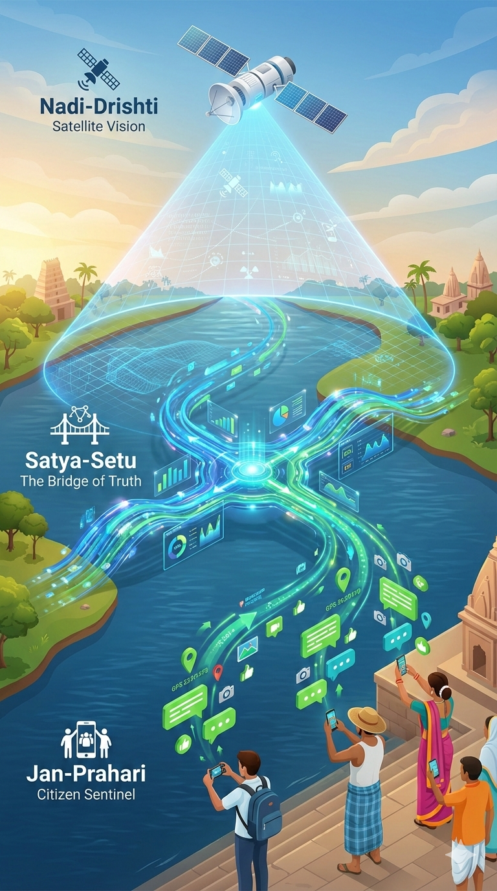

**Project Triveni-Net**

> Tagline: “Sky, Data, and People united for living rivers.”

**Mission**: To rejuvenate the Mahanadi and Kaveri rivers through AI/ML tech.

**Constraint**: Low cost, fast development MVP/POC

**Innovation Strategy**. Leveraging advanced AI/Computer Vision expertise to automate monitoring without expensive hardware sensors.

Triveni-Net is a three-part river intelligence system that unites satellite vision, open data, and citizen power to protect and heal India’s sacred rivers

At its core are three sibling projects:

- **Satya-Setu (The Bridge of Truth)**
  A data aggregation and anomaly detection dashboard that unifies fragmented government and public water-quality data (CPCB, SPCBs, Namami Gange, India-WRIS, data.gov.in, and more) and highlights “Truth Gaps” between official claims and actual river conditions.
- **Nadi-Drishti (The Vision of the River)**
  A satellite-based remote sensing system that uses free imagery (Sentinel-2, Landsat-8/9) and AI to detect turbidity, algal blooms, pollution plumes, and land-use change, creating a digital twin of river health from orbit.
- **Jan-Prahari (The Citizen Sentinel)**
  A WhatsApp-based, AI-verified reporting bot that turns citizens into human sensors, collecting geo-tagged photos of foam, plastic, and other pollution to build a real-time ground map of river abuse and cleanup needs.

Together, these three tools form Triveni-Net: **the sky watching, the data auditing, and the people witnessing**—all working in sync to make Indian rivers cleaner, safer, and more accountable.

---

**Read in-depth about 3 projects**

- [**Nadi-Drishti** _eye in the sky_](/thinking-grounds/river-research/tech-solution/nadi-dristi): a satellite-based system for river health.
- [**Jan-Prahari** _eye on the ground_](/thinking-grounds/river-research/tech-solution/Jan-Prahari): a WhatsApp-powered citizen sentinel for on-ground evidence
- [**Satya-Setu** _bridge of truth_](/thinking-grounds/river-research/tech-solution/satya-setu): a centralized intelligence dashboard designed to unify fragmented river and pollution data from multiple Indian government and public sources

---

## Three Eyes of Truth: How Nadi-Drishti and Jan-Prahari Strengthen Satya-Setu

Following points explains, in simple language, how our three tools work together to protect holy rivers: Satya-Setu reads official data and exposes gaps, Nadi-Drishti watches the river from the sky, and Jan-Prahari listens to people on the ground. Through five clear points, it shows how combining government numbers, satellite vision, and citizen reports creates a powerful “Bridge of Truth” that makes pollution harder to hide and honest river healing easier to plan

---

### 1. Who gives information to whom?

- **Nadi-Drishti helps Satya-Setu see the whole river**
  Nadi-Drishti is like a pair of eyes in the sky that keep watching the river from space and tell Satya-Setu, “This stretch looks clean, this stretch looks dirty, this place is changing colour.”
  So Satya-Setu is not depending only on what government sensors say; it also hears directly from the river’s appearance.
- **Jan-Prahari helps Satya-Setu hear people on the ground**
  Jan-Prahari is like a direct phone line from citizens to the river system: people send WhatsApp photos and locations whenever they see foam, plastic or dead fish.
  Satya-Setu then gets these as “real-world incidents” on its map, so it knows exactly where people are actually suffering or seeing pollution.
- **Result for Satya-Setu**
  Instead of being a tool that only reads official websites, Satya-Setu becomes a living system that listens to **government + sky + people** together.

---

### 2. How Nadi-Drishti makes Satya-Setu’s warnings smarter

- **Catching hidden lies or mistakes**
  If government data says “water is fine here” but Nadi-Drishti’s satellite view shows the water looking dark, muddy or green with algae, Satya-Setu can clearly say, “Something is wrong here.”
  If satellite images show clean water but the sensor numbers look extremely bad for many days, Satya-Setu can suspect the sensor is broken or not updated.
- **Judging which stations to trust**
  Over time, Satya-Setu can notice: “This station usually agrees with what the satellite shows, that one often doesn’t.”
  So each government station gets a kind of **trust score** , helping activists and officials see whose readings are believable and whose are doubtful.
- **Finding long-term danger zones**
  Nadi-Drishti can show which river stretches look bad again and again (chronic pollution) and which only suffer sometimes (after a specific discharge or event).
  Satya-Setu then highlights these places so clean-up efforts can focus where the river is being abused regularly, not just once.

---

### 3. How Jan-Prahari gives Satya-Setu ground truth

- **Turning citizen complaints into proof**
  When Satya-Setu detects a suspicious area (for example, satellite shows dirty water but official data claims “good”), it can check: “Did citizens send any photos from here?”
  If many people have reported foam, plastic or dead fish from that spot, Satya-Setu can label it as a **high-confidence problem** , supported by real photos and locations.
- **Building a story over time**
  On one stretch you might see this pattern: “Day 1: satellite shows change in water; Day 3: citizens report dead fish; government numbers didn’t change.”
  This kind of timeline helps you tell a clear story to media, courts or community leaders about what actually happened in the river.
- **Keeping the citizen data clean**
  Jan-Prahari already filters out “Good morning” messages and selfies using AI, so Satya-Setu only sees genuine pollution reports, not random noise.
  That means every red dot on Satya-Setu’s map backed by Jan-Prahari is serious and worth attention.

---

### 4. How the combined dashboard helps non-tech people act

- **One simple map for everyone**
  In Satya-Setu, you can switch on three layers: official numbers, satellite view (Nadi-Drishti), and citizen reports (Jan-Prahari).
  When you click on any hotspot, you can see: “What does the government say, what does the sky see, and what are people reporting here?” in one place.
- **Easy-to-share river stories**
  Satya-Setu can turn complex data into simple cards like: “Here the government says ‘moderate’, satellite sees high pollution, and 12 local people reported foam this week → this stretch is likely underreported.”
  These cards are easy to show in a meeting, a PIL, a newspaper article, or a satsang talk, so normal people can understand and feel the truth of the river’s condition.

### 5. Why this trio is powerful for our mission

- Nadi-Drishti makes sure **no part of the river is invisible** , even remote stretches.
- Jan-Prahari makes sure **no citizen’s pain is ignored** , turning their phone into a voice for the river.
- Satya-Setu brings all of this together to **challenge false claims and demand honest action** for the river’s health.

### 6. We are going to connect Kosh to Triveni Net
- We will be connecting Triveni Net to the Kosh. 
- We will be creating a live component. That time, we will have live data and visuals. 
